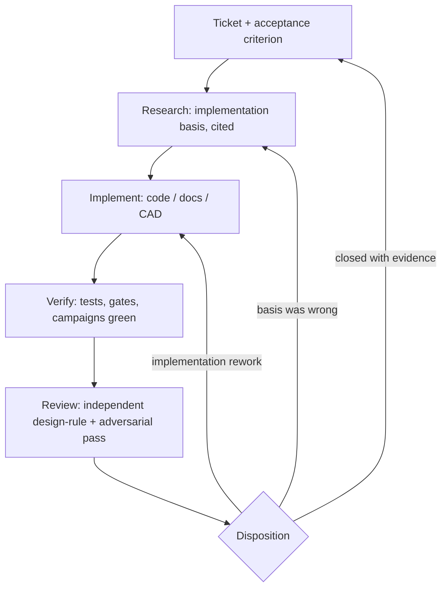

# Practice-adoption plan

Status: active remediation program, opened 2026-08-08
Source: [engineering practice survey](engineering-practice-survey.md) adoption table
Executable form: [`aiur/adoption_loop.py`](../aiur/adoption_loop.py)

Every "yes" row of the survey's adoption table is a ticket. Tickets move
through the remediation loop below; CI validates the registry the same way it
validates the CARRIER-P0 engineering loop, and a ticket never closes without
named evidence. Tickets whose final step is physical (printing, cycling,
soldering) close to `delivered_awaiting_hardware`: the fabrication-ready
artifact exists and the bench work is scheduled through the normal P0 gates.

## Remediation loop

The rule carried over from the engineering loop: nothing shortcuts to
disposition. An implemented ticket that has not passed verification and
review is in progress, not done.

## Ticket register

| Ticket | Title | Closes as |
| --- | --- | --- |
| ADOPT-001 | P0-A gate upgrade: loaded releases, force margins, derived life test | software + docs; bench execution via P0-A |
| ADOPT-002 | Bench fault-insertion unit and hardware fault quotas | fabrication-ready pack |
| ADOPT-003 | Hazard log with signed residual-risk acceptance | software + docs |
| ADOPT-004 | Dock FMECA, fault tree, common-mode analysis | docs (analysis) |
| ADOPT-005 | Correlated-pair and power-fault injection in the twin | software |
| ADOPT-006 | Machine-checked requirement closure matrix | software |
| ADOPT-007 | SIL credibility + uncertainty block, TLYF exception ledgers | software + docs |
| ADOPT-008 | Dock electrical evidence packet | docs + BOM |
| ADOPT-009 | Battery standard operating procedure | docs |
| ADOPT-010 | Kill-path independence verification | docs + gate criteria |
| ADOPT-011 | Test cards, TRR checklist, abort phraseology | docs |
| ADOPT-012 | Tolerance stack, as-built records, golden article, CAD variants | software + CAD |
| ADOPT-013 | Dock deletion review before Rev-B | docs (decision memo) |

Full deliverables and acceptance criteria live in the executable register
(`python -m aiur.adoption_loop`).

## Sequencing

1. Research pass: implementation-grade specifics (exact MIL-STD-882E
   category definitions, NASA-STD-7009B factor names, FMECA worksheet
   fields, switch contact ratings) so implementations cite bases instead of
   paraphrasing the survey.
2. Implementation fan-out: independent-file tickets in parallel; the twin
   fault-injection ticket (ADOPT-005) runs last because it touches the same
   files as the campaign changes in ADOPT-007.
3. Verification: full unit suite, all three SIL campaigns, and the tolerance
   stack must be green before any ticket is marked delivered.
4. Review: independent design-rule and adversarial pass over everything
   produced, findings fixed before disposition.

The two "later" rows from the survey (PIL equivalence rung, DFM/EVT
framing) and the one "no" row are tracked in the survey, not here.
