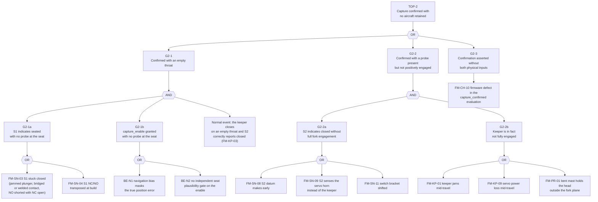

# CARRIER-P0 dock FMECA and fault trees

Status: analysis only; no article built, no failure-rate data, nothing measured
Scope: the P0 recovery interface — Rev-A dock, aircraft-side probe, S1/S2
sensing, keeper actuator, bench controller and harness

This is the bottom-up half of the completeness argument. The twin's fault menu
and the P0-A insertion list were both curated: someone thought of eight
electrical faults and eight simulated ones. A curated list cannot tell you what
is missing from it. An FMECA enumerates the space item by item, and a fault
tree enumerates it from the consequence down, and the two disagree exactly
where the coverage is thin. That disagreement is the deliverable — the
[coverage table](#coverage-of-every-mode) at the end — not the worksheet.

The worksheet follows MIL-STD-1629A Task 101. That standard is a 1980 document,
cancelled by notice in 1998, and it remains the lineage reference for FMECA
worksheets rather than a live compliance target. Nothing here is a compliance
claim: this is a civilian indoor prototype borrowing the shape of the practice
at a scale where one person can hold the whole mechanism.

Companion documents: [common-mode.md](common-mode.md) says which of the
two-event cut sets below are not independent; the [hazard log](hazard-log.md)
carries the mishap-level risk and the acceptance signatures; the
[electrical evidence packet](electrical-evidence.md) carries the switch,
pull-up, and rail analysis this worksheet cites.

## Indenture levels

MIL-STD-1629A para 4.5 organises worksheets to display the highest indenture
level first and then proceed down through decreasing levels. The levels used
here:

| Level | Item | Contents |
| ---: | --- | --- |
| 1 | Recovery interface (system) | The carrier-side dock, the aircraft-side probe, and the mount that ties the dock to the payload rail. End effects are stated at this level. |
| 2 | Funnel and collet | Ø180 mm funnel, Ø16 mm throat, compliant first-capture insert |
| 2 | Probe | Ø12 mm head, Ø3 mm mast, sacrificial base, aircraft attachment |
| 2 | Keeper and actuator | Sliding fork with a 4.2 mm slot, guides, closed end-stop, XL330-M288-T and its bracket and horn |
| 2 | Sensing S1 / S2 | Two SPDT snap-action switches, their brackets and datums, dual-contact NC+NO decode |
| 2 | Controller and harness | OpenRB-150, `DockController` firmware, pull-ups, connectors, returns, servo bus |
| 3 | Piece parts | Individual tines, fasteners, conductors, contacts — reached only where a mode lives there |

The system boundary stops at the recovery interface. Carrier buoyancy, the
envelope, the tether, aircraft flight control, and the Lighthouse positioning
system are outside it, with one deliberate exception: the positioning system
enters the analysis as an *interface input*, because the supervisor's
seat-plausibility gate is computed from it. It appears in the fault trees as a
basic event, not as a worksheet row.

## Ground rules

1. **Article.** Rev-A P0-A1 as defined in
   [p0a-fabrication.md](../hardware/dock/p0a-fabrication.md): printed funnel and
   keeper, XL330-M288-T on a removable bracket, gold-contact SPDT switches with
   external pull-ups, OpenRB-150 bench controller,
   `capture_confirmed = S1 AND S2`.
2. **Mission phases.** Every row names one. `bench` = P0-A, propellers removed,
   manual insertion. `approach` = aircraft airborne, dock empty, keeper open.
   `lock` = probe at the seat, keeper travelling (controller `LOCKING`).
   `carry` = capture confirmed, aircraft disarmed and carried. `release` =
   commanded release and separation. `emerg` = emergency release. `all` = any.
3. **Single-failure rule.** Each worksheet row assumes one failure mode active
   with everything else nominal. Para 5.6.3 requires end effects from a double
   failure to be indicated on the worksheets; those are marked in Remarks and
   developed properly in the [fault trees](#fault-trees).
4. **Assumed working.** The physical kill path and release inhibit
   ([kill-path.md](kill-path.md)), the bench supply inside its set current
   limit, the fault-insertion unit in its pass-through state, and an operator
   present with abort authority. Each has its own analysis; none is re-derived
   here.
5. **Detection means detection during the run.** The detection column reports
   what the P0 instrumentation set actually sees while the mechanism is in use:
   the dual-contact decode, the controller state and fault reason, servo
   telemetry, and an operator watching a bench article. Post-run teardown is
   written as `none (inspection only)` because an inspection that happens after
   the aircraft has fallen did not detect anything — it recorded it. Those rows
   are the argument for Rev-B sensing, and they are meant to be conspicuous.
6. **No criticality numbers.** Task 102 computes `Cm = beta x alpha x lambda_p x t`
   from a part failure rate and an operating time. No article exists, no part
   has run an hour, and there is no MIL-HDBK-217 line for a printed PLA fork.
   Producing `Cm` here would be arithmetic on invented inputs. Criticality is
   therefore carried qualitatively as severity crossed with detection, and the
   Task 102 criticality matrix is deferred until P0-A life cycling and the
   run-to-failure campaign produce counts.
7. **Severity is assigned to the worst credible end effect of the mode**, per
   1629A para 3.1.6, not to its most likely one.

## Severity classification

MIL-STD-1629A para 4.4.3, verbatim, with the program reading of each class.
The verbatim column is the standard; the program column is this project's
tailoring, and it is documented tailoring rather than an approved alternate —
the same position the [hazard log](hazard-log.md) takes on MIL-STD-882E
Table I.

| Class | 1629A para 4.4.3 (verbatim) | Program reading |
| :---: | --- | --- |
| I — Catastrophic | "A failure which may cause death or weapon system loss (i.e., aircraft, tank, missile, ship, etc.)" | Death, or loss of the gas envelope with an uncontrolled descent |
| II — Critical | "A failure which may cause severe injury, major property damage, or major system damage which will result in mission loss." | Severe injury (a powered aircraft at head height, an unrestrained mass falling from carrier height), or destruction of the only dock article or a flight article, which stops the campaign |
| III — Marginal | "A failure which may cause minor injury, minor property damage, or minor system damage which will result in delay or loss of availability or mission degradation." | An aborted approach, a lost run set, a dropped disarmed aircraft, a cracked part found at teardown |
| IV — Minor | "A failure not serious enough to cause injury, property damage, or system damage, but which will result in unscheduled maintenance or repair." | A cleaning, a reprint, a re-torque; no run-set outcome changes |

**No mode in this worksheet is classed I.** Under the program reading, Class I
needs envelope loss or death, and the dock has no path to either on its own: no
recovery load is reacted through the gas envelope
([dock README](../hardware/dock/README.md)), and helium asphyxiation is a
facility hazard rather than a dock failure mode (HAZ-009). The dock reaches
Class I only through a chain that runs outside this boundary — a released
powered aircraft striking the envelope — and that chain is carried as HAZ-003.
Saying "no Class I" is a scoping statement, not a safety claim.

## FMECA worksheet

Columns are MIL-STD-1629A Task 101 paras 5.1–5.10. Para 5.4 keeps failure modes
and their causes in one column; they are split here into two so the table can
be read, which is a formatting choice and not a change of method.

### Level 1 — recovery interface and mount

| ID | Item/function | Function | Failure mode | Cause | Mission phase | Local effect | Next higher effect | End effect | Detection method | Compensating provisions | Severity class | Remarks |
| --- | --- | --- | --- | --- | --- | --- | --- | --- | --- | --- | :---: | --- |
| FM-AS-01 | Dock-to-rail mount, 4 x M3 on 40 mm square | React capture and retention load into carrier structure; hold the dock datum | Fastener backs out, preload lost | Servo and rotor vibration, no thread locker, polymer creep under the boss, repeated re-fixturing | all | Dock shifts on its mount | Funnel, keeper and switch datums move together | Missed captures; at the limit the dock departs the rail with an aircraft retained | none (inspection only) — P0-A step 15 | Torque spec plus thread locker and witness marks; a loosened fastener is a campaign stop rule | II | One loosening event moves the keeper and the S2 datum at once — a coupling, see common-mode.md CP-3 |
| FM-AS-02 | Same | Same | Mount joint loses stiffness with fasteners still tight | Elongated printed hole, cracked boss, over-torque at build, side loads from aborted approaches | all | Compliant mount, datum wanders under load | Keeper engagement depth varies with load | Intermittent retention; S2 datum no longer means what it meant at calibration | none | 1 N four-direction lateral screening loads before and after cycling; as-built dimension record | II | Harder to find than a loose screw because nothing rattles |
| FM-AS-03 | Recovery interface (system) | Turn an approach into a positively retained aircraft, and release it on command | Interface retains the probe after release is commanded | Collet set, debris or galling in the fork slot, keeper binding under residual load | release, emerg | Probe held after the keeper opens | Aircraft cannot separate | Aircraft stuck on the dock; run set ends; hand recovery under the carrier | S1 stays made after release; controller release timeout to FAULT_OPEN | Release timeout; >=10 loaded emergency-release trials with zero failures | III | Becomes II if the aircraft spins up against a jammed interface |

### Level 2 — funnel and collet

| ID | Item/function | Function | Failure mode | Cause | Mission phase | Local effect | Next higher effect | End effect | Detection method | Compensating provisions | Severity class | Remarks |
| --- | --- | --- | --- | --- | --- | --- | --- | --- | --- | --- | :---: | --- |
| FM-FC-01 | Funnel, Ø180 mm to Ø16 mm throat | Convert lateral approach error into probe centring; carry entry loads to the mount | Crack or fracture at the mounting flange | Layer-adhesion plane at the flange fillet of a printed part, repeated off-axis entry loads, over-torqued fasteners | approach, carry | Local loss of stiffness | Throat position shifts, entry cone distorts | Missed captures; at full separation a 180 g assembly departs with the aircraft | none (inspection only) | 1.2 mm wall is a starting section to be weighed and inspected on the real part; cracking is a stop rule | II | Print orientation at the flange is a design action, not an inspection item |
| FM-FC-02 | Funnel surface | Low-friction guidance | Friction rises, surface degrades | Dust, print debris, finger oils, abrasion over 600+ cycles | approach | Probe hangs on the cone | Probe does not reach the throat inside the abort window | Approach aborts; capture rate falls | Insertion-force trend during run-in only; none in flight | Pre-session wipe; run-in force trend must level off before life cycling | III | Degraded output per para 5.4.f |
| FM-FC-03 | Funnel throat | Guide a Ø12 mm head into the keeper | Throat out of tolerance, undersize or oversize | Print variation, post-machining, thermal warp | bench, approach | Probe binds at the throat, or enters with excess slop | Seated position uncertain | S1 actuation point uncertain; ambiguous capture | As-built caliper record, P0-A step 2 | Tolerance stack in `aiur/tolerance.py`; go/no-go on the throat before assembly | III | |
| FM-FC-04 | Compliant collet | Passive first capture; hold the probe while the keeper travels | Collet takes a set, spring force decays | Creep in the TPU or spring insert after 600+ cycles, heat, storage compressed | approach, lock | No passive first capture | Probe can bounce out during keeper travel | Capture attempt fails and the approach aborts | Insertion/release force per cycle during run-in; none in flight | Keeper, not the collet, owns retention after capture; run-in plus life cycling with a force trend | III | Becomes a drop only in combination with a false S2 — order-2, see TOP-2 |
| FM-FC-05 | Compliant collet | Same | Collet grips the probe and will not release | Over-tight fit after set or swelling, debris, galling | release | Probe retained after the keeper opens | Separation does not occur | Aircraft cannot depart; powered separation attempt loads the mast and the funnel | S1 remains made after release; release timeout | Release timeout to FAULT_OPEN; A0 fit measurement before the insert geometry is frozen | II | Failure to cease operation, para 5.4.d |
| FM-FC-06 | Compliant collet | Same | Collet grips off-centre | Uneven wear, one-sided loading from repeated approaches on one bearing | lock | Probe seated off axis | Fork meets the mast off-centre | Keeper jams or engages on one tine only | none (inspection only) | 4.2 mm fork slot on a Ø3 mm mast leaves clearance for modest offset | III | |

### Level 2 — probe

| ID | Item/function | Function | Failure mode | Cause | Mission phase | Local effect | Next higher effect | End effect | Detection method | Compensating provisions | Severity class | Remarks |
| --- | --- | --- | --- | --- | --- | --- | --- | --- | --- | --- | :---: | --- |
| FM-PR-01 | Probe mast, Ø3 mm | Present the head to the keeper on the dock axis | Mast bends, takes a plastic set | Side load during a bad approach or abort, probe used as a handle, tilt at funnel contact | approach onward | Mast off axis | Head no longer concentric with the fork | Keeper misses or jams; at the limit the head is not over the tines when S2 makes | none (inspection only) | Sacrificial base feature; straightness go/no-go before each session | II | Degraded output that turns into a retention failure without ever tripping a sensor |
| FM-PR-02 | Probe mast | Carry retention load between head and aircraft | Mast fractures | Fatigue at the base fillet across 600+ cycles, or a single overload | carry | Aircraft parts from the head | Retention path broken above the keeper | Captured aircraft falls | none | 5 N axial screening load before and after cycling; run-to-failure cycling records the wear-out mode | II | |
| FM-PR-03 | Probe head, Ø12 mm | Provide a positive under-head surface for the fork | Head wears undersize | 600+ cycles of throat and fork contact on a printed head; abrasive dust | carry | Head diameter approaches the 4.2 mm slot and Ø16 mm throat clearances | Fork no longer positively under the head | Head pulls through the fork under load; aircraft dropped | none (inspection only) — caliper at teardown | As-built and post-cycle head diameter; golden-article comparison | II | The wear is monotonic and invisible until it matters; a per-session gauge is the cheap fix |
| FM-PR-04 | Probe base, sacrificial feature | Break before the Crazyflie PCB does | Breakaway feature releases below its design load | Breakaway load is TBD by physical test; print variation; fatigue after repeated side loads | approach, carry | Probe separates from the aircraft | Nothing left to retain | Aircraft leaves the dock, or an approach continues with no probe | none | Breakaway load must come from a physical test, never from CAD (p0a-bench.md) | II | Premature operation, para 5.4.a: the sacrificial feature working too early is itself a failure mode |
| FM-PR-05 | Probe-to-airframe attachment | Tie the probe into the frame, not the shell | Attachment loosens | Small fasteners on a 37 g aircraft, vibration, no re-torque interval | all | Probe rocks on the aircraft | Seat depth varies cycle to cycle | S1 chatter; retention load path drifts toward the PCB | Pre-session pull check only | Probe mass budget <=8 g; pre-session torque and pull check | III | |
| FM-PR-06 | Probe head surface | Enter the throat cleanly | Debris or adhesive residue on the head | Handling, funnel dust, tape residue | approach | Throat clearance reduced | Probe binds before seating | Approach aborts | Insertion force at the bench | Wipe procedure before each session | IV | |

### Level 2 — keeper and actuator

| ID | Item/function | Function | Failure mode | Cause | Mission phase | Local effect | Next higher effect | End effect | Detection method | Compensating provisions | Severity class | Remarks |
| --- | --- | --- | --- | --- | --- | --- | --- | --- | --- | --- | :---: | --- |
| FM-KP-01 | Sliding fork keeper, 4.2 mm slot | Translate under the Ø12 mm head and hold it against the closed end-stop | Keeper jams mid-travel | Debris or print stringing in the guides, galling, a bent tine, foreign object in the slot | lock | Keeper stops between open and closed | S2 never makes | Lock timeout to FAULT_OPEN, keeper commanded open, approach aborts | Lock timeout with S2 absent; servo position and current telemetry | 1.0 s lock timeout (bench configuration, to be tuned from measured travel); SERVO_STALL insertion trial; guide inspection | III | Safe by design as long as S2 tells the truth; see FM-SN-08/09 for when it does not |
| FM-KP-02 | Same | Same | Keeper stops short of full engagement while S2 still makes | S2 datum set too early, guide wear, keeper bows under side load, partial travel accepted as closed | lock | Tines are not fully under the head | Capture confirmed on a partial engagement | Retention margin gone; the aircraft is disarmed onto a hold that is not there; drop | none — S2 is one binary at one datum | S2 must sense the mechanism at the closed stop, never the servo horn (p0a-fabrication.md); go/no-go on the S2 datum | II | This is the mechanical half of TOP-2 branch G2-2 |
| FM-KP-03 | Same | Same | Keeper closes on an empty throat | The controller commands close on entering LOCKING; with S1 reading seated and the enable granted, the throat can be empty | lock | Fork closes on nothing | S2 correctly reports the keeper closed | With S1 also reading seated, `capture_confirmed` is true with no aircraft; a flying aircraft is disarmed | partial — S2 closed while the controller is in OPEN decodes as `keeper_reports_closed_while_open`; once S1 reads seated, nothing distinguishes closed-on-probe from closed-on-empty | Supervisor seat-plausibility gate and latched enable (twin findings 1 and 2); the Rev-B discriminating sensor does not exist | II | The mechanism has no signal for "there is a probe under my fork". This row is the Rev-B argument in one line |
| FM-KP-04 | Same | Same | Keeper back-drives out of engagement under retention load | Geartrain back-drive, loss of the closed mechanical detent, side load walking the fork | carry | Keeper walks out from under the head | Fork leaves the head | Captured aircraft dropped | partial — S2 opens only after travel past the switch reset point; a partial back-drive that frees the head with S2 still made is undetected | Mechanically stable closed geometry: rigid guides and a closed end-stop react load, not the servo geartrain; 5 N axial load held 10 s before and after cycling | II | The undetected band between "head free" and "S2 opens" is a measurable quantity; measure it at A0 |
| FM-KP-05 | Same | Release the head on command | Keeper fails to open when commanded | Galling under load, insufficient torque at minimum voltage, debris in the guides | release | Keeper stays closed | Aircraft cannot separate | Aircraft stuck on the dock; the emergency path becomes the only way out | Release timeout to FAULT_OPEN; S2 stays made | `keeper_open_force_margin` >=2.0 at minimum voltage; >=10 loaded emergency releases with zero failures | II | Failure to operate at a prescribed time, para 5.4.b |
| FM-KP-06 | Same | Stay open until commanded closed | Keeper closes with no capture enable | Spurious close command, servo runaway, horn slip driving the fork, control-table corruption | approach | Fork crosses the throat while a probe is entering | Probe strikes the keeper | Probe and keeper damage, aborted approach, aircraft upset directly under the carrier | S2 makes while the controller is in OPEN, giving FAULT_OPEN | Controller commands open in every state except LOCKING/CAPTURED/FAULT_LOCKED; uncommanded keeper motion is a campaign stop rule | II | Premature operation, para 5.4.a |
| FM-KP-07 | Keeper tines, guides, end-stop | React the retention load | Tine, guide, or end-stop fractures | 600+ cycles on a printed part, 5 N screening load, stress riser at the slot root | carry | Retention geometry gone | Nothing under the head | Captured aircraft dropped | none (inspection only) | Derived 600-cycle life test; pre and post screening loads; run-to-failure to find the wear-out mode | II | |
| FM-KP-08 | XL330-M288-T | Translate the keeper | Servo stalls against a blocked keeper | Obstruction, over-travel into a stop, under-voltage at the connector | lock | 1.47 A at 5 V drawn with no motion (ROBOTIS e-manual) | Lock timeout; heat into an 18 g actuator | Approach aborts; repeated stall drive degrades the actuator (HAZ-010) | Lock timeout; servo current and temperature telemetry | Motion limits set from the physical stops before cycling; no repeated stall drive; SERVO_STALL trial | III | Also the source of the rail transient in FM-CH-05 |
| FM-KP-09 | XL330-M288-T | Same | Servo loses power mid-travel | Connector unmate, supply trip, harness break, brownout on the servo rail | lock, carry | Keeper stops where it is | If short of the stable closed geometry, retention is never established | Approach aborts; an already-captured probe stays retained because the keeper is not the load path | S2 state plus loss of servo telemetry | SERVO_POWER_LOSS trial with the required response written first; closed geometry stable without power | III | Becomes II in combination with a keeper stopped short of the stable geometry — order-2 in TOP-1 |
| FM-KP-10 | Servo horn and output spline | Map commanded position to keeper position | Horn slips on the spline | Over-torque into a stop, under-tightened horn screw, plastic spline wear over 600+ cycles | lock, carry | Commanded position no longer means keeper position | Keeper may sit short of closed, or drift from it under load | False travel, loss of the closed datum, retention lost | none — the encoder reports the servo, not the keeper | S2 senses the mechanism rather than the servo, which is exactly the mode that rule defends against; horn witness mark checked at inspection | II | The single strongest argument for the "S2 is not on the horn" rule |
| FM-KP-11 | XL330-M288-T | Same | Servo overheats or thermal-shuts-down | Repeated stall drive; operating range ends at +70 °C (ROBOTIS e-manual) | lock | No keeper motion | Lock timeout | Approach aborts; actuator degraded or dead for the session | Servo temperature telemetry | Stall-drive limiting; HAZ-010 mitigations | III | Loss of output, para 5.4.e |
| FM-KP-12 | XL330-M288-T control table | Hold commanded position and limits | Commanded position drifts or limits are corrupted | TTL bus error, brownout during a control-table write, an unchecked write from firmware | all | Keeper commanded to a wrong position | Keeper travels with no operator or state-machine intent | Uncommanded keeper motion, possibly with an aircraft retained | S2 changes with no corresponding command in the state trace | Uncommanded keeper motion is a stop rule; motion limits re-verified at power-on | II | Argues for reading the control table back after every write |

### Level 2 — sensing S1 and S2

| ID | Item/function | Function | Failure mode | Cause | Mission phase | Local effect | Next higher effect | End effect | Detection method | Compensating provisions | Severity class | Remarks |
| --- | --- | --- | --- | --- | --- | --- | --- | --- | --- | --- | :---: | --- |
| FM-SN-01 | S1 seat switch | Independently detect a physically seated probe | S1 stuck open, never indicates seated | Contact film on a contact operated below its minimum applicable load; jammed plunger; broken lever; open conductor | lock | No seat indication | Controller never leaves OPEN | No capture; approach aborts; the aircraft is never disarmed | Dual-contact decode reads a valid released pair — which is indistinguishable from "no probe seated" | Gold-alloy contacts with an external pull-up above the datasheet floor; `S1_OPEN` trial | III | Fails in the safe direction. See the contact-film note below the worksheet |
| FM-SN-02 | S1 seat switch | Same | S1 intermittent: chatter or high-resistance make | Contact film, bracket resonance, connector fretting under rotor and servo vibration | lock, carry | Seat indication flickers | LOCKING gives `probe_lost_during_lock`; CAPTURED gives `capture_sensor_disagreement` | Approach aborts, or a good capture drops into FAULT_LOCKED | Debounce plus the controller state trace, which names the reason | 20 ms debounce; contact current above the datasheet floor; harness strain relief rules H1–H3 | III | Intermittent operation, para 5.4.c. The dominant real-world electrical mode |
| FM-SN-03 | S1 seat switch | Same | S1 stuck closed, indicates seated with no probe | Plunger mechanically jammed actuated by debris, a deformed lever, or a shifted bracket; contacts bridged by contamination or welded by inrush; NO conductor shorted to ground while the NC conductor is open | approach, lock | Permanent seat indication | LOCKING can be entered with an empty throat | With the enable granted, `capture_confirmed` on an empty dock and a flying aircraft disarmed | **none** — a mechanically stuck-actuated switch presents a decode-valid "actuated" pair; only the supervisor's own seat estimate disputes it, and that estimate comes from the same navigation source | Supervisor plausibility gate and latched enable (twin findings 1 and 2); `S1_SHORT` trial; the Rev-B discriminator does not exist | II | Half of the program's headline residual. See the contact-film note: the below-minimum-load mechanism produces an *open*, not a weld |
| FM-SN-04 | S1 wiring | Present a decodable NC+NO pair | S1 NC and NO conductors transposed at build | Assembly error, unkeyed or identically-populated connectors, unlabelled conductors | all | Released decodes as actuated | Permanent false seat indication | As FM-SN-03, from a single build error | none in run; caught only by the power-on decode check with a meter, if it is actually performed | H5 keying by different position counts; H7 labelling at both ends; validate the truth table with a meter before connecting the state machine | II | A build error with the same end effect as a hardware failure, and a cheaper fix |
| FM-SN-05 | S1 mounting and actuation | Stay actuated once the probe is seated | S1 actuated by maintained force rather than by position | Switch chosen or mounted so the seated position does not hold over-travel once weight transfers to the keeper | carry | S1 opens on weight transfer | CAPTURED gives `capture_sensor_disagreement` and FAULT_LOCKED | Nuisance fail-locked on every otherwise good capture | Controller state trace; requirement P0-DOCK-010 | P0-DOCK-010 states that an S1 which opens on weight transfer is a hardware defect, not something to tune around in software | III | |
| FM-SN-06 | S2 keeper-closed switch | Independently detect the keeper at its closed stop | S2 stuck open, never indicates closed | As FM-SN-01 | lock | No closed indication | Lock timeout to FAULT_OPEN and the keeper commanded open | No capture; approach aborts; a physically closed keeper is driven back open | Dual-contact decode reads a valid released pair; the mismatch against servo telemetry is visible | `S2_OPEN` trial; gold contacts and sized pull-up | III | Fails in the safe direction, at the cost of the run |
| FM-SN-07 | S2 keeper-closed switch | Same | S2 stuck closed, always indicates closed | As FM-SN-03 | approach | Permanent closed indication | The controller in OPEN transitions to FAULT_OPEN on `keeper_reports_closed_while_open` | The dock is unusable, safely, before any approach | Controller state on the first step; dual-contact decode catches the harness variants | The OPEN-state check exists precisely for this | III | The one stuck-closed mode the current logic does catch, because it contradicts a state the controller already holds |
| FM-SN-08 | S2 mounting and datum | Make only at full keeper engagement | S2 makes early | Bracket loosened or shimmed, switch replaced without re-setting the datum, over-travel adjustment lost | lock | Closed indication before the fork is under the head | Capture confirmed on partial engagement | As FM-KP-02: aircraft disarmed onto a partial hold | none | Go/no-go on the S2 datum after any bracket work; the SERVO_STALL trial, where a blocked keeper must not produce S2 | II | Datum error and mechanical shortfall are separate basic events; together they are a TOP-2 cut set |
| FM-SN-09 | S2 mounting | Sense the mechanism, not the actuator | S2 senses the servo horn instead of the keeper | Build error: switch mounted on or driven by the horn or linkage rather than the keeper at its stop | lock | S2 follows the command rather than the mechanism | Any keeper obstruction yields a false closed | Capture confirmed with the keeper blocked and nothing under the head | The `SERVO_STALL` trial is exactly this test — a blocked keeper that still reports S2 fails it | p0a-fabrication.md forbids the mounting explicitly; SERVO_STALL required response makes it testable | II | A rule in a document is not a defence until a test can fail on it; SERVO_STALL is that test |
| FM-SN-10 | S2 keeper-closed switch | Same | S2 intermittent | As FM-SN-02 | carry | Closed indication flickers | CAPTURED gives FAULT_LOCKED | Fail-locked with an aircraft retained: safe, but the run ends and the aircraft must be released by hand | State trace and debounce | As FM-SN-02 | III | |
| FM-SN-11 | S1 and S2 brackets | Hold the actuation datum | Bracket loosens or shifts | Vibration, fastener without thread locker, creep in a printed bracket | all | Actuation point moves | S1 or S2 datum wrong in either direction | Early, late, or absent indication; FM-SN-03 and FM-SN-08 follow from it | none (inspection only) | Bracket inspection after every session (H10); datum go/no-go gauge | II | A single displacement can move the S2 datum and bind the keeper guide at once — common-mode CP-3 |
| FM-SN-12 | S1 and S2 switches | Actuate repeatably for the life of the article | Mechanical wear-out: operating force and actuation point drift | ~5,000 planned operations against a 100,000-operation minimum electrical durability for the gold-contact part; spring fatigue | all | Operating force drifts | Actuation point drifts | Intermittents appear late in life | Force check at inspection | Cycle-life derating to <=0.10 of the rating (electrical-evidence.md) | IV | Well inside the derate; listed so the checklist item is closed, not because it is expected |

### Level 2 — controller and harness

| ID | Item/function | Function | Failure mode | Cause | Mission phase | Local effect | Next higher effect | End effect | Detection method | Compensating provisions | Severity class | Remarks |
| --- | --- | --- | --- | --- | --- | --- | --- | --- | --- | --- | :---: | --- |
| FM-CH-01 | S1/S2 harness and connectors | Carry four switch contacts and two returns to the controller | Intermittent contact at a connector under vibration | Fretting on unsupported conductors, no strain relief, unlatched or unretained housing | all | One channel drops out for milliseconds | S1 or S2 flickers | FAULT_OPEN before capture, FAULT_LOCKED after; the run ends | Dual-contact decode, debounce, and the controller state trace | Strain relief, service loop, and clamping rules H1–H3; post-session inspection H10 | III | Intermittent connector and harness failures are the dominant electrical mode in the field; this is the row that pays for the decode |
| FM-CH-02 | Shared connector, if built | Same | One connector carrying both channels is lost | Single retention failure, single unseated latch, single mis-mate | all | Both channels open together | Both interlocks gone in one event | No capture claim possible; controller faults and stays there; emergency release must still work | Dual-contact decode reads both channels invalid | H6: separate connectors with different position counts, never a shared housing; `S1_S2_BOTH_OPEN` trial | II | The order-1 route to defeating a two-channel interlock; this is why the fault is on the required list |
| FM-CH-03 | Shared switch ground return | Reference both switch COM terminals | Common return opens | Broken crimp, one return conductor for both switches | all | All four inputs float to their pull-ups | Both channels decode invalid (NC high with NO high is not a valid pair) | No capture; the dock is unusable, safely | Dual-contact decode | Separate returns per channel (engineering target); labelling H7 | II | Fails safe only because the decode demands a *pair*, not a level |
| FM-CH-04 | Pull-up network and its rail | Bias four switch contacts above the datasheet minimum applicable load | Pull-up rail collapses, or a pull-up goes open | Regulator fault, solder joint, one shared 3.3 V node feeding all four pull-ups | all | Inputs read low or float | Channels decode invalid, or one channel falsely reads released | No capture; a false released state on one channel | Decode invalid pattern | Separate pull-up networks per channel (target, common-mode.md D3); rail current in the power-on checklist | II | Shared rail is a coupling factor, not just a schematic convenience |
| FM-CH-05 | OpenRB-150 supply | Hold the MCU rail through servo transients | Controller browns out during locking | XL330 stall and inrush near 1.47 A at 5 V on a shared rail, no rail split, no bulk capacitance, BOD not configured | lock | MCU resets mid-sequence | The latched capture enable is lost; the state machine restarts in OPEN | Approach aborts at best; see FM-CH-06 for the captured case | Only visible in the state trace if telemetry survives the reset | Rail split, bulk capacitance at the servo connector, BOD33 configured above the minimum for the configured clock (electrical-evidence.md); `CONTROLLER_RESET_DURING_LOCK` trial | III | The measured NeuroBytes case sagged to 1.3 V for hundreds of nanoseconds — invisible to a multimeter, fatal to an MCU |
| FM-CH-06 | `DockController` power-up behaviour | Report the true mechanism state after a restart | Controller resets while an aircraft is captured | Any brownout or reset source during `carry`; the same causes as FM-CH-05 in a different phase | carry | The controller has no memory of the capture | It restarts in OPEN, sees S2 closed, and enters FAULT_OPEN | **The keeper is commanded open with an aircraft retained**, and `reset_fault` cannot clear the state while the switches are made | State trace shows FAULT_OPEN with reason `keeper_reports_closed_while_open` | none in the mechanism — the closed geometry is stable only until the servo executes the commanded open | II | Executable, see the reproduction below. Not covered by `CONTROLLER_RESET_DURING_LOCK`, which resets during LOCKING |
| FM-CH-07 | Release command path | Release only on a deliberate operator action | Spurious `release_request` | Software defect, comms bit error, operator interface slip | carry | Keeper commanded open | Aircraft released | Uncommanded release, possibly over a person (HAZ-011) | State trace | Release requires a deliberate armed operator action; the physical release inhibit sits outside the software loop | II | |
| FM-CH-08 | Emergency-release input | Command open from every software state | Emergency-release line shorted or actuated in error | A single input with authority from every state; a short to the rail; a bumped control | carry | RELEASING entered from any state | Keeper opens | Uncommanded release | State trace | The authority is deliberate and is not going to be interlocked away; guard the input physically | II | A designed-in single point whose alternative — an emergency release that can be inhibited — is worse |
| FM-CH-09 | Servo signal line | Carry the TTL bus to the actuator | Signal line opens | Connector, broken conductor, bus contention | lock | No keeper motion | Lock timeout | Approach aborts | Lock timeout and loss of servo telemetry | Servo-signal open is on the fault-insertion unit's signal list | III | |
| FM-CH-10 | `DockController` capture evaluation | Assert `capture_confirmed` only for a real capture | Firmware defect in the confirmation or release logic | One code path, one MCU, no diversity; a wrong state transition; a mis-read input | all | `capture_confirmed` does not mean what the interface document says | Every downstream decision, above all disarm, is made on a false premise | Either a missed capture or a confirmed capture with nothing retained | none in the system; only unit tests and the twin, which drives the real `DockController` under fault injection | The twin runs the real controller rather than a mock; P0-A criterion `ambiguous_capture_confirmations` = 0 | II | The only order-1 cut set of TOP-2, and the one no amount of sensor redundancy touches |

### Note on the contact-film mechanism

Three rows above cite contact metallurgy, and the citation has to be placed
precisely or it becomes folklore. The Omron D2F datasheet defines the minimum
applicable load as a reliability boundary, verbatim: *"The minimum applicable
load is the N-level reference value. This value indicates the malfunction
reference level for the reliability level of 60% (λ60). (JIS C5003) The
equation, λ60=0.5×10-6/operation, indicates that the estimated malfunction rate
is less than 1/2,000,000 operations with a reliability level of 60%."* The
values are 1 mA at 5 VDC for the gold-alloy D2F-01 family and 100 mA at 5 VDC
for the silver-alloy parts. Below that current the vendor makes no reliability
claim at all.

The malfunction the film produces is a **failure to conduct** — an open or a
high-resistance make. So the below-minimum-load argument supports FM-SN-01,
FM-SN-02, FM-SN-06, and FM-SN-10, and it is the reason the
[electrical evidence packet](electrical-evidence.md) makes the gold-contact
variant a safety item rather than a preference.

It does **not** explain a stuck-closed switch. FM-SN-03 and FM-SN-07 get there
by a different route: a mechanically jammed plunger, contamination bridging the
crossbar, a contact welded by inrush, or a conductor shorted to the pull-up
rail. Writing "oxidation causes stuck closed" would be citing a real fact for a
mode it does not cause, and the resulting mitigation — better contacts — would
not touch the jammed plunger that is the actual dominant cause.

## Criticality summary

Distribution over the 49 rows:

| Severity class | Count | Of which in-run detection is `none` or `partial` |
| --- | ---: | ---: |
| I — Catastrophic | 0 | 0 |
| II — Critical | 28 | 18 |
| III — Marginal | 19 | 5 |
| IV — Minor | 2 | 2 |

Criticality here is severity crossed with detection, not a Task 102 criticality
number; see ground rule 6. The undetected Class III and IV rows — funnel
friction, collet set, off-centre collet grip, probe attachment, and a brownout
whose telemetry may not survive it — are all inspection-visible and cost a run
set rather than an article. The 18 undetected Class II rows are the document.

### The design action list

Class II modes with **no in-run detection**, which is the intersection that
matters:

| ID | Mode | Why nothing sees it |
| --- | --- | --- |
| FM-AS-01 | Mount fastener backs out | No preload sensor; found at teardown |
| FM-AS-02 | Mount joint loses stiffness | Nothing rattles; the datum simply moves under load |
| FM-FC-01 | Funnel flange cracks | No structural instrumentation on the dock |
| FM-PR-01 | Probe mast bends | Geometry, not state; the switches still read correctly |
| FM-PR-02 | Probe mast fractures | Occurs at the moment of loss |
| FM-PR-03 | Probe head wears undersize | Monotonic wear with no threshold anyone crosses visibly |
| FM-PR-04 | Sacrificial base releases early | No load path instrumentation |
| FM-KP-02 | Keeper closed short of engagement, S2 made | S2 is one binary at one datum |
| FM-KP-07 | Keeper tine or guide fractures | Occurs at the moment of loss |
| FM-KP-10 | Servo horn slips on the spline | The encoder reports the servo, not the keeper |
| FM-SN-03 | S1 stuck closed | A jammed plunger is a decode-valid "actuated" |
| FM-SN-04 | S1 NC/NO transposed at build | Same, from an assembly error |
| FM-SN-08 | S2 makes early | No second opinion on the keeper's position |
| FM-SN-09 | S2 senses the actuator | Detectable only by deliberately obstructing the keeper |
| FM-SN-11 | Switch bracket shifts | The datum moves silently |
| FM-CH-10 | Firmware defect in the capture evaluation | The evaluator cannot check itself |
| FM-KP-03 | Keeper closes on an empty throat | Partial: caught only while the controller believes it is OPEN |
| FM-KP-04 | Keeper back-drives under load | Partial: S2 opens only after travel past the switch reset point |

The pattern is not a list of unrelated gaps. Every undetected Class II mode is
one of two things:

1. **A mechanical wear or structural mode with no sensor anywhere near it.**
   FM-AS-01/02, FM-FC-01, FM-PR-01/02/03/04, FM-KP-07, FM-KP-10, FM-SN-11.
   These do not need new sensing; they need a bounded inspection interval with
   go/no-go criteria, so the worst case is one session of exposure rather than
   the whole campaign.
2. **A sensing mode where the signal that would catch it does not exist.**
   FM-KP-02/03/04, FM-SN-03/04/08/09. Every one of these is the same missing
   measurement: *is there a probe head under the fork right now?* The dock
   currently answers that question by inference from two switches that each
   answer something else.

The actions that follow:

| Action | Closes | Status |
| --- | --- | --- |
| A1 Rev-B keeper closed-position or current discrimination that separates "closed on probe" from "closed on empty throat" | FM-KP-02, FM-KP-03, FM-SN-08, FM-SN-09, and the detected band of FM-KP-04 | Candidate, not designed. The single highest-leverage change in this document |
| A2 An independent probe-present signal not derived from S1 or from navigation | FM-SN-03, FM-SN-04 | Candidate. May be the same Rev-B sensor as A1 |
| A3 A per-session go/no-go inspection set: probe head diameter, mast straightness, S1 and S2 datums, fastener witness marks, keeper guide clearance | The whole mechanical group above | Does not exist. Cheap, and it converts "none" into "detected between runs" |
| A4 Torque specification, thread locker, and witness marks on every fastener, with a pre-session witness-mark check | FM-AS-01, FM-SN-11, FM-KP-10 | Partly implied by the stop rules; not written as a procedure |
| A5 Fix `DockController` power-up so S1 AND S2 true at start is not treated as `keeper_reports_closed_while_open` with the keeper commanded open; add `CONTROLLER_RESET_WHILE_CAPTURED` to the required fault modes | FM-CH-06 | Open. Software plus a required-fault-mode change; outside this document's scope to implement |
| A6 Measure the back-drive band: how far the keeper can travel before S2 opens, and how far before the head is free | FM-KP-04 | Open, and it is an A0 bench measurement, not an analysis |

### FM-CH-06, reproduced

The reset-while-captured finding is not an inference from reading the state
machine. It is one command against the real controller:

```
python3.11 -c "
from aiur.dock_controller import DockController, DockInputs
c = DockController()                       # a controller that has just restarted
o = c.step(0.0, DockInputs(seat_switch=True, keeper_closed_switch=True))
print(o.state, o.keeper_command)           # DockState.FAULT_OPEN KeeperCommand.OPEN
"
```

A restarted controller that sees both switches made — which is exactly the
signature of a real capture — concludes that the keeper is closed while it
believes itself open, enters `FAULT_OPEN`, and commands the keeper open with an
aircraft hanging on it. `reset_fault` cannot clear `FAULT_OPEN` while the
switches are made, so the open command persists. The keeper's closed geometry
is mechanically stable, but stability is no defence against a servo that has
been told to open.

The existing `CONTROLLER_RESET_DURING_LOCK` fault mode does not cover this: it
resets during LOCKING, where nothing is retained yet. The captured case is a
different phase with a different end effect, and it is an order-1 cut set of
TOP-1.

### Para 5.4 checklist coverage

Para 5.4 requires each failure mode and output function to be examined against a
minimum list. Coverage of that list by the worksheet:

| 1629A para 5.4 condition | Rows |
| --- | --- |
| a. Premature operation | FM-KP-06, FM-KP-12, FM-PR-04, FM-CH-07, FM-CH-08 |
| b. Failure to operate at a prescribed time | FM-KP-01, FM-KP-05, FM-KP-08, FM-KP-11, FM-SN-01, FM-SN-06, FM-CH-09 |
| c. Intermittent operation | FM-SN-02, FM-SN-10, FM-CH-01, FM-CH-05 |
| d. Failure to cease operation at a prescribed time | FM-AS-03, FM-FC-05, FM-KP-05 |
| e. Loss of output or failure during operation | FM-AS-02, FM-FC-01, FM-PR-02, FM-KP-04, FM-KP-07, FM-KP-09, FM-CH-02, FM-CH-03, FM-CH-04, FM-CH-06 |
| f. Degraded output or operational capability | FM-FC-02, FM-FC-03, FM-FC-04, FM-FC-06, FM-PR-01, FM-PR-03, FM-PR-05, FM-PR-06, FM-KP-02, FM-KP-10, FM-SN-05, FM-SN-08, FM-SN-11, FM-SN-12 |
| g. Other unique failure conditions | FM-AS-01, FM-KP-03 (a correct indication of the wrong physical state), FM-SN-03, FM-SN-04, FM-SN-09 (indication inverted, or sensing the wrong body), FM-CH-10 (the confirmation logic itself is wrong) |

Condition (g) is where this mechanism actually lives. Four of its five rows are
about a sensor telling the truth about something other than the question being
asked, which is a failure class no amount of contact-quality work touches.

## Fault trees

Two top events, taken from the program's two catastrophic outcomes: dropping an
aircraft that should be held, and claiming to hold an aircraft that is not
there. They are near-inverses, and a mechanism tuned to avoid one tends to move
toward the other, which is why both are analysed.

The NASA *Fault Tree Handbook with Aerospace Applications* v1.1 section 3.4
prescribes the definition order:

> "In defining the top event, it is important to define the event in terms of
> the specific criteria that define the occurrence of the event. Generally to do
> this for a system failure, the system success criteria are first defined. Then
> failure of the system is defined as the failure to satisfy the given success
> criteria."

Decomposition follows section 4.4's immediate cause concept — "the immediate,
necessary, and sufficient causes for the occurrence of this top event ... not
the basic causes of the event but the immediate causes", one step at a time,
which the handbook calls the Think Small Rule.

Basic events reuse the FMECA IDs so the two analyses stay one artefact. Three
basic events come from outside the dock boundary and have no worksheet row:

| ID | Basic event | Source |
| --- | --- | --- |
| BE-N1 | Relative navigation error places the estimated probe position at the seat when it is not there | Single-source Lighthouse bias; twin finding 3; HAZ-002 |
| BE-N2 | The supervisor grants `capture_enable` without an independent seat plausibility check | Guidance software; twin finding 2 |
| BE-OP | Operator commands a release with a person or equipment underneath | Procedure; HAZ-011 |

### TOP-1: aircraft released or dropped when it should be retained

**Success criteria.** From the instant `capture_confirmed` is asserted until an
intentional release — either a deliberate operator `release_request` or a
deliberate use of the emergency-release path — the mechanism retains the probe
against the P0 screening loads (5 N axial and 1 N lateral, held 10 s) with no
loss of retention and no keeper motion that was not commanded.

**Top event.** The negation: within that interval, retention is lost, or the
keeper opens, without an intentional and authorised release command.

```mermaid
flowchart TD
    T1["TOP-1<br/>Aircraft released or dropped<br/>while it should be retained"]
    T1 --> GT1{{"OR"}}
    GT1 --> G11["G1-1<br/>Retention geometry does not hold"]
    GT1 --> G12["G1-2<br/>Keeper leaves engagement<br/>with no release command"]
    GT1 --> G13["G1-3<br/>Release is commanded<br/>when it must not be"]
    GT1 --> G14["G1-4 (transfer)<br/>TOP-2 occurred: the aircraft was<br/>disarmed onto a hold that was not there"]

    G11 --> GA{{"OR"}}
    GA --> E1["FM-KP-07 keeper tine,<br/>guide or end-stop fractures"]
    GA --> E2["FM-PR-02 probe mast fractures"]
    GA --> E3["FM-PR-03 probe head worn undersize,<br/>pulls through the fork slot"]
    GA --> E4["FM-PR-04 sacrificial base releases<br/>below its design load"]
    GA --> E5["FM-PR-05 probe-to-airframe<br/>attachment fails"]
    GA --> E6["FM-AS-01 mount or keeper<br/>fastener backs out"]
    GA --> E7["FM-AS-02 mount joint loses stiffness"]
    GA --> E8["FM-FC-01 funnel flange fractures,<br/>dock departs the rail"]

    G12 --> GB{{"OR"}}
    GB --> E9["FM-KP-04 keeper back-drives<br/>under retention load"]
    GB --> E10["FM-KP-10 servo horn slips<br/>on the output spline"]
    GB --> E11["FM-KP-12 uncommanded servo motion<br/>from control-table corruption"]
    GB --> GB2["G1-2a<br/>Keeper never reached<br/>stable closed geometry"]
    GB2 --> GC{{"AND"}}
    GC --> E12["FM-KP-09 servo loses<br/>power mid-travel"]
    GC --> E13["FM-KP-01 keeper stopped short<br/>of the closed end-stop"]

    G13 --> GD{{"OR"}}
    GD --> E14["FM-CH-06 controller reset while captured:<br/>restarts in OPEN, faults, commands open"]
    GD --> E15["FM-CH-07 spurious release_request"]
    GD --> E16["FM-CH-08 emergency-release input<br/>shorted or actuated in error"]
    GD --> E17["FM-CH-10 firmware defect<br/>in the release path"]
    GD --> E18["BE-OP operator releases<br/>over a person"]
```



**Minimal cut sets.** The handbook's definition, verbatim (section 3.8):

> "A minimal cut set, informally termed a minimal failure set, is a smallest set
> of basic events, which if they all occur will result in the top event
> occurring. The set is minimal in that if any of the events do not occur then
> the top event will not occur by this combination of basic events. A given
> fault tree will have a finite number of unique minimal cut sets. The minimal
> cut sets identify all the distinct ways the top event can occur in terms of
> the basic events."

Order-1 cut sets — the single-point-of-failure list, which is the main output of
this whole document:

| # | Cut set | Class | Mitigated by |
| ---: | --- | :---: | --- |
| 1 | {FM-KP-07} keeper tine/guide/end-stop fracture | II | 600-cycle life test, screening loads, run-to-failure |
| 2 | {FM-KP-04} keeper back-drive under load | II | Mechanically stable closed geometry; screening loads |
| 3 | {FM-KP-10} servo horn slips on the spline | II | S2 senses the mechanism, not the servo; witness mark |
| 4 | {FM-KP-12} uncommanded servo motion | II | Motion limits; uncommanded motion is a stop rule |
| 5 | {FM-PR-02} probe mast fracture | II | Screening loads before and after cycling |
| 6 | {FM-PR-03} probe head worn undersize | II | Post-cycle head diameter; golden-article comparison |
| 7 | {FM-PR-04} sacrificial base releases early | II | Breakaway load TBD by physical test |
| 8 | {FM-PR-05} probe-to-airframe attachment fails | III | Pre-session pull check |
| 9 | {FM-AS-01} mount or keeper fastener backs out | II | Torque, thread locker, witness marks, stop rule |
| 10 | {FM-AS-02} mount joint loses stiffness | II | Lateral screening loads; as-built record |
| 11 | {FM-FC-01} funnel flange fracture to separation | II | Inspection; print orientation at the flange |
| 12 | {FM-CH-06} controller reset while captured | II | **Nothing.** Action A5 |
| 13 | {FM-CH-07} spurious `release_request` | II | Deliberate armed operator action; physical inhibit |
| 14 | {FM-CH-08} emergency-release line shorted | II | Physical guarding; the authority is deliberate |
| 15 | {FM-CH-10} firmware defect in the release path | II | Unit tests; the twin drives the real controller |
| 16 | {BE-OP} release over a person | II | Test-card procedure; kill path; HAZ-011 |

Order-2 cut sets:

| Cut set | Note |
| --- | --- |
| {FM-KP-09, FM-KP-01} servo power loss while the keeper is short of the closed end-stop | Neither alone loses a capture; the pair does |
| {TOP-2} as a transfer: any TOP-2 cut set followed by disarm | TOP-2 is a cause of TOP-1, which is why the two trees are not independent analyses |
| {FM-FC-04, FM-KP-01} collet set with a keeper that never engaged | Requires the aircraft to be held by the collet alone at the moment of loss |

**Reading of TOP-1.** Sixteen order-1 cut sets is not a redundancy failure; it
is what a single positive mechanical latch *is*. The dock has one retention
path by design, and no amount of sensing changes that. Every entry in the table
above is therefore closed by a load test, a life test, an inspection, or a
procedure — except entry 12, `{FM-CH-06}`, which is closed by nothing and is a
software change.

### TOP-2: capture confirmed with no aircraft retained

**Success criteria.** `capture_confirmed` is asserted if and only if both of the
following physically hold: a probe head is seated at the throat, and the keeper
fork is fully engaged beneath that head against the closed end-stop.
Additionally, the aircraft is disarmed only while `capture_confirmed` is true.

**Top event.** The negation: `capture_confirmed` is asserted — thereby
permitting disarm — while either condition is false.



**Minimal cut sets.**

Order-1:

| # | Cut set | Why it is the only one |
| ---: | --- | --- |
| 1 | {FM-CH-10} firmware defect in the capture evaluation | The confirmation is computed once, in one code path, on one MCU. No amount of sensor redundancy is upstream of a wrong evaluator |

Order-2:

| # | Cut set | Coupled? | Note |
| ---: | --- | --- | --- |
| 1 | {FM-SN-03, BE-N1} S1 stuck closed + navigation bias masking the position error | **No** — two independent faults | **The residual the twin found.** See below |
| 2 | {FM-SN-03, BE-N2} S1 stuck closed + no plausibility gate on the enable | No | BE-N2 is design-eliminated by twin finding 2, and stays eliminated only while the gate is in the flight software |
| 3 | {FM-SN-04, BE-N1} S1 transposed at build + navigation bias | No | Same end effect as 1, from an assembly error |
| 4 | {FM-SN-08, FM-KP-01} S2 makes early + keeper jams short | No | Two independent mechanism faults |
| 5 | {FM-SN-09, FM-KP-01} S2 on the horn + keeper obstructed | No | Exactly what the `SERVO_STALL` insertion trial tests |
| 6 | {FM-SN-08, FM-KP-09} S2 makes early + servo power loss mid-travel | No | |
| 7 | {FM-SN-09, FM-KP-09} S2 on the horn + servo power loss mid-travel | No | |
| 8 | {FM-SN-11, FM-KP-01} bracket shift moving the S2 datum + keeper binding in its guide | **Yes** | One bracket displacement can produce both; see common-mode.md CP-3 |
| 9 | {FM-SN-11, FM-PR-01} bracket shift + bent mast | Partly | Both often follow the same bad approach |

**The structural result.** Apart from the shared firmware path, **TOP-2 has no
order-1 cut sets**. That is what `capture_confirmed = S1 AND S2` buys, and it
is worth stating as a positive finding: the two-switch interlock is genuinely
single-fault tolerant for false confirmation, and the dual-contact NC+NO decode
is what makes it so. Faking a decode-valid "actuated" from wiring alone takes
two conductor faults — the NC line open *and* the NO line shorted low — because
the decode demands a *pair*, not a level. A single short, a single open, a
collapsed pull-up rail, or a lost common return all land on an invalid pair and
are detected.

That result is also exactly why the next document exists. An order-2 cut set is
only twice as safe as an order-1 cut set if the two events are independent, and
several of the sets above are not. Cut set 8 is one displacement wearing two
hats. Cut sets 4 through 7 pair two switches that share a part number, a lot, a
rail, a bracket region, a harness route, a debounce implementation, and an
operator. Treating those as `Q1 x Q2` overstates the margin by roughly the ratio
of the common-cause fraction to the single-channel failure probability;
[common-mode.md](common-mode.md) does that arithmetic and names the pairs the
twin has to draw together.

**The residual, stated plainly.** TOP-2 cut set 1 — `{S1 stuck closed,
navigation bias masking the position error}` — is the residual the digital twin
found (finding 5, HAZ-001). It is *not* a common-cause pair: a jammed switch
plunger and a Lighthouse bias have no shared mechanism, no shared part, and no
shared environment, and modelling them with a beta factor would be wrong. What
makes the pair matter is different and worse: **the safety case has no defence
against it.** Every software check that could arbitrate is computed from the
same navigation measurement the bias is in, so no supervisor built on that
source can tell. The pair is rare and undefended, rather than likely and
coupled, and the two situations call for different responses — sampling for the
first, a new signal for the second. The new signal is action A1: a keeper
sensor that can distinguish closed-on-probe from closed-on-empty, which is the
one measurement no navigation fault can spoof.

## Coverage of every mode

Each worksheet row mapped to the fault kinds in `aiur/sim/faults.py`, the
hardware modes in `REQUIRED_FAULT_MODES` (`aiur/p0a_evidence.py`), and the other
P0-A evidence that touches it. The verdict column is the work list: `GAP` means
no fault of that kind can currently be injected in either the twin or the bench,
and where the mode is nonetheless covered by a load test, a life test, or an
inspection, that is stated rather than hidden.

| Mode | Twin fault kind | Hardware insertion mode | Other P0-A evidence | Verdict |
| --- | --- | --- | --- | --- |
| FM-AS-01 fastener backs out | GAP — no wear or preload model | GAP | Post-cycle inspection, stop rule | GAP for injection; inspection only |
| FM-AS-02 mount stiffness loss | GAP | GAP | `lateral_screen_load_held_n` pre and post | GAP for injection; load-tested |
| FM-AS-03 interface will not release | GAP | GAP | `loaded_emergency_release_failures`, release timeout | GAP for injection; load-tested |
| FM-FC-01 funnel flange crack | GAP | GAP | `structural_failures`, run-to-failure | GAP for injection; life-tested |
| FM-FC-02 funnel friction rise | GAP | GAP | Run-in force trend | GAP for injection |
| FM-FC-03 throat out of tolerance | GAP — geometry is fixed per episode | GAP | As-built record, `aiur/tolerance.py` | GAP for injection; tolerance-analysed |
| FM-FC-04 collet takes a set | GAP | GAP | Run-in force trend, `life_test_cycles` | GAP for injection; life-tested |
| FM-FC-05 collet jams the probe | GAP | GAP | Loaded emergency-release quota | GAP for injection |
| FM-FC-06 collet grips off-centre | GAP | GAP | Inspection | GAP |
| FM-PR-01 mast bends | GAP | GAP | Inspection; golden article | GAP for injection |
| FM-PR-02 mast fractures | GAP | GAP | `axial_screen_load_held_n`, run-to-failure | GAP for injection; load-tested |
| FM-PR-03 head wears undersize | GAP | GAP | As-built and post-cycle measurement | GAP for injection |
| FM-PR-04 base releases early | GAP | GAP | Breakaway load TBD by test | GAP; the load itself is not yet known |
| FM-PR-05 probe attachment loosens | GAP | GAP | Pre-session pull check | GAP |
| FM-PR-06 debris on the head | GAP | GAP | Insertion force | GAP |
| FM-KP-01 keeper jams mid-travel | `KEEPER_SERVO_JAM` | `SERVO_STALL` | Lock timeout in the state trace | Covered |
| FM-KP-02 partial engagement with S2 made | GAP — the twin's keeper switch has no fault channel | GAP — no partial-travel insertion | none | **GAP, Class II, undetected** |
| FM-KP-03 keeper closes on empty throat | `SEAT_SWITCH_STUCK_CLOSED` produces it | `S1_SHORT` produces it | `ambiguous_capture_confirmations` | Covered as a consequence; the discriminating signal is still absent |
| FM-KP-04 keeper back-drives | GAP | GAP | `axial_screen_load_held_n` held 10 s | GAP for injection; load-tested at one load, one duration |
| FM-KP-05 keeper will not open | GAP | GAP (near-miss: `SERVO_STALL` is a close, not an open) | `keeper_open_force_margin`, loaded releases | GAP for injection; force-margined |
| FM-KP-06 premature closure | GAP | GAP | Stop rule on uncommanded keeper motion | GAP |
| FM-KP-07 keeper fracture | GAP | GAP | `structural_failures`, life test, run-to-failure | GAP for injection; life-tested |
| FM-KP-08 servo stalls | `KEEPER_SERVO_JAM` | `SERVO_STALL` | Servo telemetry | Covered |
| FM-KP-09 servo power loss mid-travel | Partial — `KEEPER_SERVO_JAM` freezes travel but models no loss of holding or telemetry | `SERVO_POWER_LOSS` | Written required response | Partial |
| FM-KP-10 horn slips on the spline | GAP | GAP | Witness mark at inspection | **GAP, Class II, undetected** |
| FM-KP-11 servo overheats | GAP | GAP (thermal is not on the insertion list) | Servo temperature telemetry | GAP |
| FM-KP-12 uncommanded servo motion | GAP | GAP | Stop rule | **GAP, Class II** |
| FM-SN-01 S1 stuck open | `SEAT_SWITCH_STUCK_OPEN` | `S1_OPEN` | — | Covered |
| FM-SN-02 S1 intermittent | GAP — stuck faults are latching; there is no chatter fault | GAP — insertion is a held open or short, not a chatter | Debounce, state trace | **GAP; the dominant real electrical mode** |
| FM-SN-03 S1 stuck closed | `SEAT_SWITCH_STUCK_CLOSED` | `S1_SHORT` | `ambiguous_capture_confirmations` | Covered |
| FM-SN-04 S1 NC/NO transposed | GAP | GAP | Power-on decode check with a meter | GAP; a build-time check, if performed |
| FM-SN-05 S1 opens on weight transfer | GAP | GAP | P0-DOCK-010, S1 state trace across disarm | GAP for injection; requirement exists |
| FM-SN-06 S2 stuck open | GAP — `keeper_switch.fault` is never set by the injector | `S2_OPEN` | — | Partial: hardware only |
| FM-SN-07 S2 stuck closed | GAP — same | `S2_SHORT` | Controller OPEN-state check | Partial: hardware only |
| FM-SN-08 S2 makes early | GAP | GAP | none | **GAP, Class II, undetected** |
| FM-SN-09 S2 senses the horn | GAP | Partial — `SERVO_STALL` is the test, if the S2 response is written into the required response | Build inspection | Partial |
| FM-SN-10 S2 intermittent | GAP | GAP | Debounce, state trace | GAP |
| FM-SN-11 switch bracket shifts | GAP | GAP | H10 inspection | **GAP, Class II, undetected** |
| FM-SN-12 switch wear-out | GAP | GAP | Cycle-life derate to 0.10 of rating | GAP; inside the derate |
| FM-CH-01 harness intermittent | GAP | Partial — held opens, not vibration-driven intermittents | H1–H3, H10 | Partial |
| FM-CH-02 shared connector lost | GAP | `S1_S2_BOTH_OPEN` | H6 separate connectors | Covered on hardware; GAP in the twin |
| FM-CH-03 common return opens | GAP | `S1_S2_BOTH_OPEN` is the closest | Decode | Partial |
| FM-CH-04 pull-up rail collapse | GAP | GAP | Power-on checklist rail currents | GAP |
| FM-CH-05 brownout during locking | GAP — no controller-reset fault kind exists | `CONTROLLER_RESET_DURING_LOCK` | Scope capture of the rail transient | Partial: hardware only |
| FM-CH-06 reset while captured | GAP | **GAP** — the required mode resets during LOCKING, not during carry | none | **GAP, Class II, order-1 cut set of TOP-1** |
| FM-CH-07 spurious release request | GAP | GAP | State trace | GAP |
| FM-CH-08 emergency-release shorted | GAP | GAP | State trace | GAP |
| FM-CH-09 servo signal open | GAP | Listed on the fault-insertion unit's signal table, not in `REQUIRED_FAULT_MODES` | Lock timeout | Partial |
| FM-CH-10 firmware defect | Structural — the twin drives the real controller, so a defect in it shows up as behaviour | GAP | Unit tests, `ambiguous_capture_confirmations` | Partial, and irreducible |
| BE-N1 navigation bias | `POSE_BIAS` | GAP | Twin finding 3, HAZ-002 | Covered in the twin only |
| BE-N2 no plausibility gate | Structural — the gate is in `aiur/sim/guidance.py` | GAP | Twin findings 1 and 2 | Covered in the twin only |

### Work list from the gaps

Ordered by what closes the most Class II undetected modes per unit of effort.
None of these is implemented here; this document's scope is the analysis.

| # | Work item | Closes | Owner |
| ---: | --- | --- | --- |
| W1 | Give the twin's `keeper_switch` a fault channel: `KEEPER_SWITCH_STUCK_OPEN` / `_CLOSED`. Today `FaultInjector.step` sets `dock.seat_switch.fault` and never touches `keeper_switch`, so half the interlock is unfalsifiable in simulation | FM-SN-06, FM-SN-07, and the S2 half of every TOP-2 cut set | ADOPT-005 |
| W2 | Add a controller-reset fault kind to the twin and `CONTROLLER_RESET_WHILE_CAPTURED` to `REQUIRED_FAULT_MODES`; fix the power-up handling so both switches made at start is read as a capture rather than as `keeper_reports_closed_while_open` with the keeper commanded open | FM-CH-06 (order-1 TOP-1), FM-CH-05 | ADOPT-005 plus a controller change |
| W3 | Write the S2 integrity acceptance explicitly into the `SERVO_STALL` required response: a blocked keeper must not produce S2, and the trial fails if it does | FM-SN-09 | Fault-insertion procedure |
| W4 | Add an intermittent/chatter insertion mode — a commanded contact bounce at a set rate and duration — in both the twin and the bench unit. Held opens and shorts do not exercise the debounce | FM-SN-02, FM-SN-10, FM-CH-01 | ADOPT-005 plus the insertion unit |
| W5 | Add a partial-travel keeper fault to the twin (stop at a commanded fraction of travel) and pair it with an S2 datum offset | FM-KP-02, FM-SN-08 | ADOPT-005 |
| W6 | Draw correlated pairs rather than single faults, from the table in common-mode.md | Cut sets 4–8 of TOP-2, CP-1 to CP-7 | ADOPT-005 |
| W7 | Write the per-session go/no-go inspection set (A3) and the fastener witness-mark procedure (A4) | The whole mechanical undetected group | Bench procedure |
| W8 | Measure the back-drive band at A0: keeper travel from engaged-and-holding to head-free, and from head-free to S2-open | FM-KP-04 | A0 bench measurement |

Nothing on this list is a modelling nicety. W1 and W2 each close a Class II mode
that no test in the program can currently produce, and W2 closes a
single-point-of-failure that a one-line script demonstrates today.
