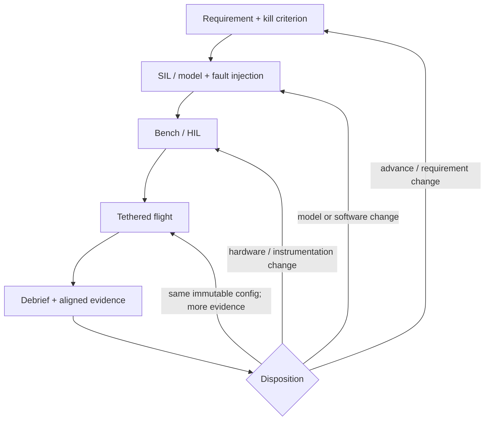
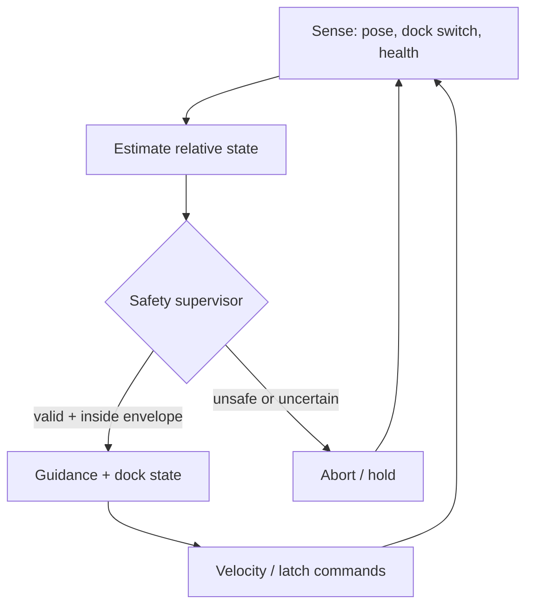

# CARRIER-P0 closed-loop engineering graph

Status: working program contract  
Scope: CARRIER-P0 through P0-D

This is the operating loop for the prototype. A capability only advances when a measured evidence packet closes the current gate. A demo, video, or successful one-off attempt is not a gate by itself.

The shape intentionally matches the public rapid-autonomy pattern of model/sim → operation → debrief/learn, while adding explicit bench/HIL promotion and safety constraints for this vehicle. Anduril publicly describes a mission cycle spanning modeling and simulation, mission operations, and data-driven debrief/learning; this document does not claim to reproduce any private Anduril process.

Reference: https://www.anduril.com/lattice/mission-autonomy

## Development loop

The key rule is simple: **if hardware, software, calibration, or safety configuration changes, the article does not jump directly back to flight.** Re-entry happens at the lowest stage that can expose the new failure mode. Direct `Disposition → Flight` is reserved for collecting more evidence with the exact same configuration.

The executable form of this graph and its gate criteria lives in [`aiur/loop_graph.py`](../aiur/loop_graph.py). CI checks the graph for unsafe flight shortcuts and evaluates the gate logic.

## Runtime recovery loop

The flight software should be built around a second, faster loop. Safety is a supervisor, not an afterthought in the docking state machine.

A physical carrier kill path and release inhibit remain outside this software loop. They must still work if the autonomy computer is confused or unavailable.

## What every requirement contains

Each requirement promoted into this loop gets five fields:

| Field | Meaning | P0 example |
| --- | --- | --- |
| ID | Stable trace key | `P0-DOCK-002` |
| Observable | What is measured | terminal closing speed |
| Limit | Numeric or Boolean gate | `≤ 0.20 m/s` |
| Failure response | What the system does | abort approach |
| Evidence source | Where truth comes from | synchronized flight + dock telemetry |

No subjective adjectives such as “stable,” “robust,” or “good recovery” close a gate unless they are reduced to an observable.

## Promotion contract

Every test run has an immutable configuration identity and enough information to reproduce the article:

- `run_id` and gate ID;
- Git commit SHA;
- hardware revision and dock revision;
- configuration/calibration hash;
- carrier and aircraft identifiers;
- measured carried mass;
- synchronized monotonic timestamps;
- operator/observer and test location;
- outcome plus abort/failure reason.

The minimum time-aligned recovery telemetry is:

- relative `x/y/z` position and estimate validity;
- relative velocity and commanded velocity;
- `S1` probe-seat switch state;
- keeper/servo command and independent `S2` keeper-closed state;
- drone arm/disarm state;
- carrier control/kill state;
- state-machine state and abort reason.

Video is useful corroboration, but telemetry is the primary gate evidence.

## P0 gate ladder

| Gate | Article | Promotion evidence | Stop / fail condition |
| --- | --- | --- | --- |
| P0-A | dock on rigid bench; props removed | ≥50 manual cycles; dock ≤180 g; probe ≤8 g; hold 5 N axial + 1 N lateral screening loads; dual-sensor capture truth; ≥10 emergency releases with zero failures | any structural damage, ambiguous capture, load-test release, or failed emergency release |
| P0-B | moving suspended dock + live aircraft | ≥9/10 captures; max closing speed ≤0.20 m/s; zero prop/funnel contacts; safety abort has zero failures | contact, overspeed, failed abort, or missing telemetry |
| P0-C | tethered helium carrier | ≥9/10 captures; zero envelope strikes; zero abort failures; no full-payload control loss | envelope strike, abort failure, loss of carrier control, or incomplete evidence |
| P0-D | tethered carrier + two aircraft | complete sequential release/recovery; positive separation; zero simultaneous dock approaches; zero envelope strikes | separation violation, simultaneous approach, or envelope strike |

P0 gates are sequential. Passing P0-C does not waive P0-A or P0-B evidence after a material dock redesign.

## Disposition taxonomy

After a run set, use exactly one primary disposition:

- `PASS` — evidence closes every criterion for the current gate;
- `FAIL_REQUIREMENT` — the requirement/limit was wrong or incomplete;
- `FAIL_MODEL` — prediction or scenario coverage was wrong;
- `FAIL_SOFTWARE` — behavior/configuration violated the requirement;
- `FAIL_HARDWARE` — mechanism, sensor, actuator, or structure violated the requirement;
- `INVALID_TEST` — instrumentation, setup, or procedure cannot support a conclusion;
- `ABORTED_SAFETY` — a safety path intentionally stopped the run.

`ABORTED_SAFETY` is not automatically a bad result: a correctly triggered abort can be positive safety evidence. It still does not count as a successful capture.

## Campaign stop rules

Stop the active run set and return to bench/HIL on any of the following:

- gas-envelope contact;
- propeller/funnel contact;
- uncommanded keeper motion or release;
- loss of the physical carrier kill/release-inhibit path;
- invalid relative-pose data that does not force an abort/hold;
- a configuration change made without generating a new configuration identity.

The loop is working when failures become small, attributable, and reproducible. CARRIER-P0 is done when autonomous recovery is repeatable enough to be boring—not when one cinematic flight works.
