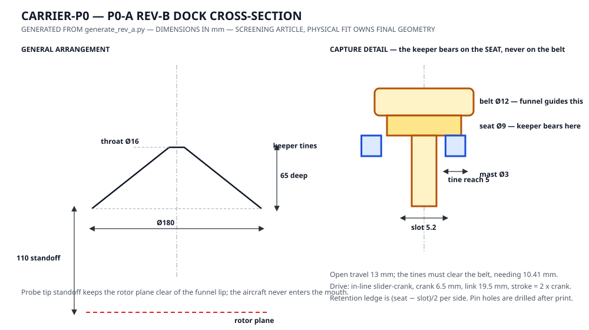

# P0 belly recovery dock

The P0 dock is a mechanically positive capture interface for recovering a micro-UAV beneath a slowly moving buoyant carrier.

It is mounted to the carrier's structural payload rail. **No recovery load is reacted through the gas envelope.**

## Why this geometry

The control system should not need millimeter-perfect coincidence in free flight. The hardware absorbs the last part of the alignment problem.

The current dimensioned first article is [P0-A Rev-B](p0a-bench.md):



The drawing is generated from the same parameters as the parts, so a
dimension on it cannot disagree with the geometry that gets printed. The
hand-drawn predecessor did exactly that: it still showed a Ø6 seat and a
4.2 mm slot after Rev-B moved both, and nothing could detect it.

Build path, in order:

1. [Fabrication packet](p0a-fabrication.md) — sourcing and electrical interface
2. [Reproducible CAD pack](cad/README.md) — regenerates the printed parts
3. [Keeper drive](keeper-drive.md) — slider-crank delivering the 13 mm stroke; guides and bracket are bench-set
4. [Assembly](assembly.md) — order of operations and the three adjustments that decide whether it works
5. [Electrical evidence packet](../../docs/electrical-evidence.md) — first power-on
6. [Bench procedure](p0a-bench.md) and its [test card](p0a-test-card.md) — running the gate

Rev-A is superseded. It failed three critical tolerance stacks and its
keeper could not retract far enough to release a captured aircraft; it
remains constructible from the same generator only so those failures stay
reproducible.

## Carrier-side assembly

P0 targets:

- 180 mm funnel entrance diameter;
- compliant structural mounting;
- low-friction polymer funnel surface;
- independent servo keeper on a slider-crank drive;
- `S1` physical probe-seat switch;
- `S2` physical keeper-closed switch independent of the servo command;
- total dock mass ≤180 g;
- no exposed sharp edge within the drone approach volume.

The servo is not the alignment mechanism: the funnel converts lateral error into probe centring before the keeper moves at all. The spring collet that used to sit between them is deleted — see the [deletion review](../../docs/dock-deletion-review.md) — so the keeper owns retention outright. Capture truth is `S1 AND S2`; a commanded servo position is never sufficient evidence.

## Drone-side probe

Target mass: ≤8 g including fasteners.

The probe sits on the top side of the aircraft so the vehicle can remain upright underneath the carrier. It should have:

- a light mast tied into the drone frame rather than a cosmetic shell;
- a rounded terminal feature that cannot hook the funnel during an abort;
- a sacrificial/breakaway feature before loads can damage the flight controller PCB;
- enough vertical clearance to keep propellers outside the funnel.

Final dimensions follow physical fit testing; do not lock a production interface from CAD alone.

## Capture state machine

```text
IDLE
  -> APPROACH
  -> FUNNEL_CONTACT
  -> PROBE_SEATED
  -> KEEPER_CLOSED
  -> CAPTURE_CONFIRMED
  -> DRONE_DISARMED
```

Any timeout before `CAPTURE_CONFIRMED` commands an abort, not a forced latch.

Capture confirmation should be based on the physical interface. Position estimate alone is not proof of capture.

The executable keeper interlock is [`aiur/dock_controller.py`](../../aiur/dock_controller.py). Before confirmed capture it fails open so the vehicle can abort. After confirmed capture, contradictory sensor state fails locked so software does not drop a docked aircraft; emergency release retains explicit authority to command open.

## Release state machine

```text
DOCKED
  -> RELEASE_ARMED
  -> KEEPER_OPEN
  -> PHYSICAL_SEPARATION
  -> FLIGHT_CONTROL_ACTIVE
```

The exact rotor-start/release timing is a test result. P0 does not encode an unvalidated free-fall or powered-release maneuver as doctrine.

## P0 exclusions

Do not add these until mechanical recovery passes:

- charging contacts;
- battery swap robotics;
- doors or an internal hangar;
- electromagnets as the primary retention mechanism;
- simultaneous multi-drone recovery;
- deployment through the lifting envelope.

## Bench test fixture

Before flight, construct a fixture that can translate the dock laterally at low speed while the aircraft approaches it. Instrument at minimum:

- relative position estimate;
- commanded velocity;
- `S1` probe-seat state;
- `S2` keeper-closed state;
- servo command/state;
- aircraft arm/disarm state;
- timestamped success/abort reason.

The test rig is the place to break docking hardware, not the airship.

P0-A uses the rigid fixture and cycle/load procedure in [p0a-bench.md](p0a-bench.md). P0-B introduces suspended motion only after P0-A evidence closes.
