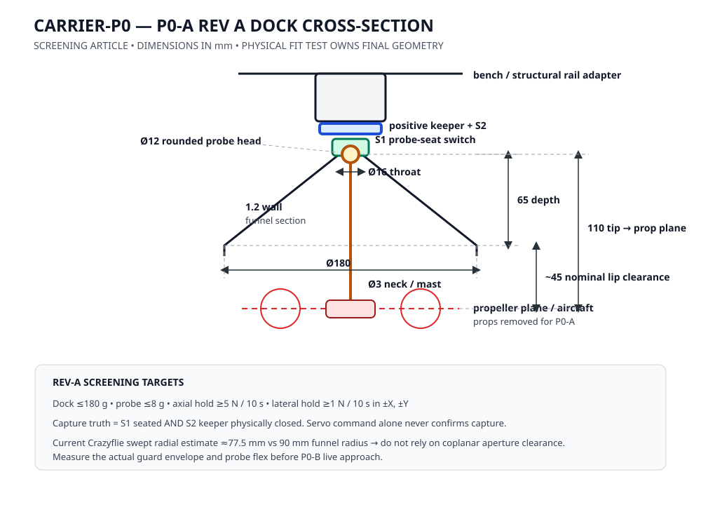

# P0-A Rev-A bench article

Status: build definition, not measured hardware  
Gate: P0-A — bench capture  
Flight condition: **propellers removed**

P0-A proves the mechanical and electrical truth of the recovery interface before any live approach. The result is not “the latch worked once.” The result is a repeatable evidence packet showing that the probe can enter, the keeper can positively retain it, capture indication cannot lie trivially, and an operator can release it every time.

## Rev-A starting geometry

These dimensions are a first article for fit testing. They are not production interface control dimensions.

| Feature | Rev-A target | Why |
| --- | ---: | --- |
| Funnel mouth | Ø180 mm | Existing P0 capture-envelope target |
| Funnel throat | Ø16 mm | Guides a Ø12 mm probe head into the keeper |
| Funnel depth | 65 mm | Keeps the funnel shallow enough to preserve rotor-plane standoff |
| Funnel wall | 1.2 mm nominal | Printable starting section; weigh the real part |
| Probe head | Ø12 mm rounded | Large enough for a positive under-head keeper |
| Probe neck | Ø3 mm nominal | Keeper acts on the neck, not friction on the head |
| Probe tip above prop plane | 110 mm nominal | Creates vertical separation between funnel lip and rotors |
| Dock-side assembly | ≤180 g | Existing carrier mass allocation |
| Drone-side probe assembly | ≤8 g | Existing aircraft-side allocation |
| Bench adapter | 4 × M3 on 40 mm square | Rev-A fixture interface only; not the final carrier rail ICD |

The probe base must contain a deliberately sacrificial feature so a bad side-load damages a replaceable probe part before the Crazyflie PCB. The breakaway load is **TBD by physical test**; do not invent a production value from CAD.

## Clearance sanity check

Bitcraze currently specifies the Crazyflie 2.1 Brushless at a 100 mm diagonal motor-center frame size with 55 mm propellers. The current guard-equipped takeoff weight is 37 g.

Source: https://www.bitcraze.io/products/crazyflie-2-1-brushless/

Using the motor-center radius plus prop radius gives a conservative radial swept extent of approximately:

`50 mm + 27.5 mm = 77.5 mm`

The Ø180 mm funnel has a 90 mm mouth radius, leaving only 12.5 mm of coplanar radial clearance. **Therefore the design must not rely on the drone fitting through the funnel mouth.** The probe standoff keeps the propeller plane below the lip.

With a 65 mm funnel depth and 110 mm probe-tip standoff, the centered seated geometry has about 45 mm nominal vertical separation between the funnel lip and propeller plane. At 15° vehicle tilt, a 77.5 mm radial extent can rise roughly 20 mm, leaving about 25 mm nominal clearance. This is a geometry sanity check only. P0-B must verify the actual aircraft including prop guards, probe flex, manufacturing tolerance, and attitude excursions before live capture.

## Mechanical stack

The carrier-side mechanism has five jobs, in order:

1. Funnel converts lateral error into probe centering.
2. Spring collet provides passive first capture.
3. `S1` independently detects that the probe is physically seated.
4. Servo moves a positive keeper underneath the probe head.
5. `S2` independently detects the keeper's closed position.

`capture_confirmed = S1 AND S2`.

Servo command is **not** keeper feedback. `S2` must sense the mechanism itself with a limit switch or equivalent physical position sensor.

The spring collet prevents an instantaneous bounce-out while the keeper moves, but the positive keeper owns retention after capture. An electromagnet is not part of the primary load path.

## Controller behavior

The reference state machine is [`aiur/dock_controller.py`](../../aiur/dock_controller.py).

| Situation | Required behavior |
| --- | --- |
| Probe not seated | keeper commanded open |
| `S1` seats while capture is enabled | command keeper closed; do not claim capture yet |
| `S1` + `S2` true | capture confirmed |
| Probe lost before confirmed capture | fail open so the approach can abort |
| Sensor disagreement after confirmed capture | fail locked; software must not drop a docked aircraft |
| Normal release | command open, then wait for physical separation |
| Emergency release | commands open from every software state |

The 1.0 s lock/release timeouts in the reference controller are initial bench configuration, not certified limits. Measure the actuator distribution across the cycle test and tune before P0-B.

## Bench fixture

Mount the dock vertically with the funnel facing down from a rigid plate. The plate reacts load; nothing in P0-A is attached to the helium envelope.

Use a probe coupon or the real aircraft with battery removed and propellers removed. Manual insertion is sufficient for P0-A. The later P0-B rig introduces relative motion.

Instrument at minimum:

- `S1` probe-seat state;
- `S2` keeper-closed state;
- keeper command;
- controller state and fault reason;
- monotonic timestamp;
- applied retention screening load;
- measured dock mass and probe mass.

## P0-A procedure

1. Photograph and weigh the complete dock and complete aircraft-side probe.
2. Verify propellers are removed and the fixture cannot fall onto a person.
3. Power the keeper with no probe present. Confirm `S2=false` when physically open.
4. Insert the probe without capture enabled; the keeper must remain open.
5. Enable capture, seat the probe, and verify `S1` alone does not report capture.
6. Close the keeper and verify capture is reported only when both `S1` and `S2` are true.
7. Apply a **5 N axial downward screening load for 10 s**. No release or structural damage is allowed.
8. Apply a **1 N lateral screening load for 10 s in +X, −X, +Y, and −Y**. No release or structural damage is allowed.
9. Complete 50 manual capture/release cycles. Every fifth cycle is an emergency-release trial, giving at least 10 emergency-release trials.
10. Repeat the 5 N axial and 1 N four-direction lateral screening loads after cycle 50.
11. Inspect the funnel, probe base, collet, keeper, fasteners, switches, wiring, and mount for cracks, looseness, permanent deformation, or intermittent indication.
12. Reduce the raw run to the exact P0-A metrics in `aiur.loop_graph.evaluate_gate("P0-A", metrics)`.

The 5 N and 1 N loads are **P0 screening targets, not airworthiness/qualification loads**. A nominal guard-equipped aircraft with Lighthouse deck and the full 8 g probe allocation is about 47.7 g, so 5 N is roughly 10.7× its static weight. Future aircraft and outdoor operation require a real loads program.

## Gate evidence

P0-A passes only when every executable criterion passes:

| Metric | Pass |
| --- | ---: |
| `manual_cycles` | ≥50 |
| `dock_mass_g` | ≤180 |
| `probe_mass_g` | ≤8 |
| `axial_screen_load_held_n` | ≥5.0 N |
| `lateral_screen_load_held_n` | ≥1.0 N |
| `structural_failures` | 0 |
| `ambiguous_capture_confirmations` | 0 |
| `emergency_release_trials` | ≥10 |
| `emergency_release_failures` | 0 |
| `propellers_installed` | 0 |

Use [`p0a-run-template.csv`](p0a-run-template.csv) as the raw cycle sheet. Missing evidence is a failed gate, not an implied pass.

## Stop conditions

Stop the run and disposition the failure before continuing if:

- the keeper opens under a screening load;
- the probe or base shows cracking/permanent deformation;
- either switch flickers or contradicts visible mechanism state;
- the keeper moves without a command;
- emergency release fails once;
- a fastener loosens;
- wiring enters the funnel/probe load path.

After a design change, issue a new hardware revision and restart the relevant screening/cycle evidence. Do not append changed hardware to the same 50-cycle run.

